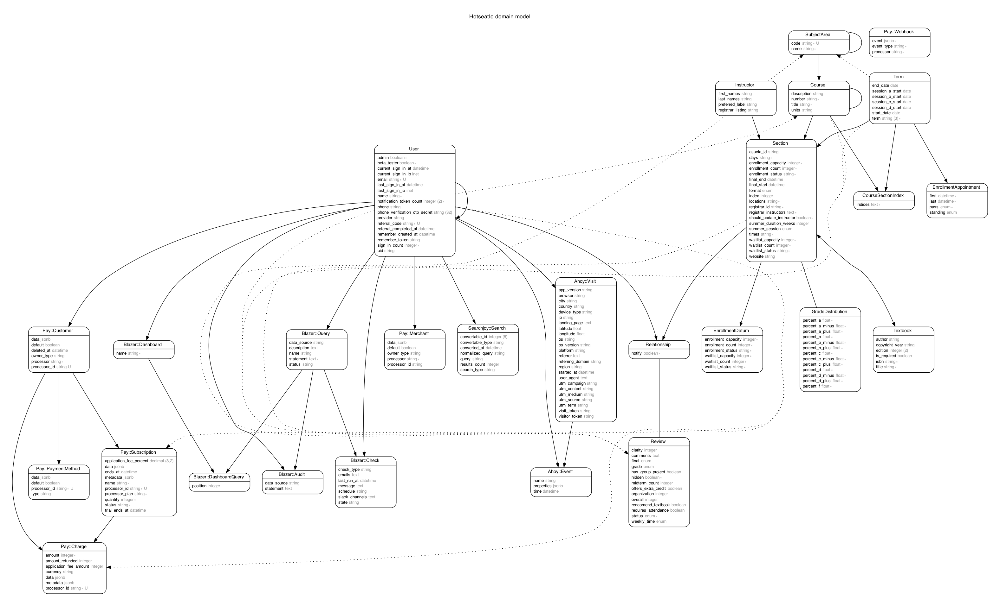

# hotseat.io

The monorepo for [hotseat.io](https://hotseat.io).

## Install Dependencies

### macOS

Install [Homebrew](https://brew.sh/). Then run:

```sh
brew install docker --cask
brew install go rbenv nodenv yarn pre-commit terraform postgresql@14 overmind tmux stripe/stripe-cli/stripe opensearch

# You may have to start the DB and OpenSearch services:
brew services start opensearch
brew services start postgres
```

### Arch / Manjaro

(Using pamac, but any AUR helper should work.)

```sh
pacman -S docker go nodejs yarn python-pre-commit terraform postgresql opensearch
pamac build ruby-build overmind stripe-cli-bin

# You may have to start the DB and OpenSearch services:
systemctl start opensearch.service postgresql.service
```

## Setup

```sh
# Get the code to Hotseat!
git clone https://github.com/hotseatio/hotseat.io.git
cd hotseat.io

# Set up Ruby
rbenv init # follow the instructions listed
rbenv install
gem install bundler
bundle install

# Set up Node.js
nodenv init # follow the instructions listed
nodenv install
yarn

# Set up pre-commit hooks
pre-commit install

# Set up the database
# (Get the database dump file from the Slack)

# This will fail if you haven't set up the hotseat_dev db before. You can skip if so!
dropdb hotseat_dev
createdb hotseat_dev
psql -f path/to/dump.sql -d hotseat_dev # replace the path!

# Set up dev.hotseat.io
echo -e "# Hotseat dev server\n127.0.0.1 dev.hotseat.io" | sudo tee -a /etc/hosts

# Start the server
bin/dev
```

You may run into errors if you don't have a `.env.development.local` in the root directory. This is because the following environment variables are not provided:

- `STRIPE_PUBLIC_KEY`
- `STRIPE_PRIVATE_KEY`
- `STRIPE_SIGNING_SECRET`
- `GOOGLE_CLIENT_ID`
- `GOOGLE_CLIENT_SECRET`

If you're in DevX, let Nathan know and he can share some test keys with you!

### Setup Tests

In a separate terminal, run the following:

```
rspec
# If this fails with:
#     Selenium::WebDriver::Error::UnknownError:
#       unknown error: cannot find Chrome binary
# make a new file .env.test.local with content:
#     WD_CHROME_PATH=<path to chrome>
#
# <path to chrome> is the "Executable Path" on chrome://version/

cd lambdas/ && make test
```

## Development

### Starting the server

You can start the server with:

```sh
bin/dev
```

This will start both the Rails backend and the JavaScript frontend.

You can visit your local Hotseat development site at http://dev.hotseat.io:3000 or http://localhost:3000.

### Debugging

We use [byebug](https://github.com/deivid-rodriguez/byebug) for debugging. Simply drop a `byebug` and get an interactive prompt. To connect to byebug while running overmind, use:

```
overmind connect web
```

See [this article](https://blog.testdouble.com/posts/2020-03-17-improving-dev-experience-with-overmind/) for details.

### Entity Diagram

```
bundle exec erd
```



### The Sorbet Dance

```sh
rake sorbet:update:all
```

### Writing Tests

#### Ruby

We use Rspec and FactoryBot for our testing. Our general testing philosophy is:

- Test model functionality though model specs.
- Test mail tests through mailer specs.
- Test helpers through helper specs.
- Prefer request specs for integration testing, unless interactivity is required in which case go for the heavier system spec.
- Avoid view specs, as it's easy for them to go out of date and give a false sense of security. Prefer request or system specs instead.
- Avoid controller specs, as they're [no longer recommended](https://rspec.info/blog/2016/07/rspec-3-5-has-been-released/#rails-support-for-rails-5) by the RSpec and Rails teams (in favor of request and system specs).
- Avoid feature specs, as they're [no longer recommended](https://rspec.info/blog/2017/10/rspec-3-7-has-been-released/#rails-actiondispatchsystemtest-integration-system-specs) (in favor of system specs).

`spec_helper.rb` is for specs which don't depend on Rails (such as specs for classes in the lib directory). `rails_helper.rb` is for specs which do depend on Rails (in a Rails project, most or all of them). When in doubt, go with `rails_helper.rb`

Custom matchers go in `spec/support/matchers`. Custom helper functions go in `spec/support/helpers`.

You can run all tests with:

```
rspec
```

#### JavaScript/React

We test React components via Jest. Tests should be of the form `spec/javascript/*.spec.{js,ts,jsx,tsx}`. You can run all tests with:

```
yarn test
```

## Organization

Hotseat is a basic Rails app and follows Rails conventions for the most part. The lambda functions are stored in `lambdas/`; they contain their own documentation.
